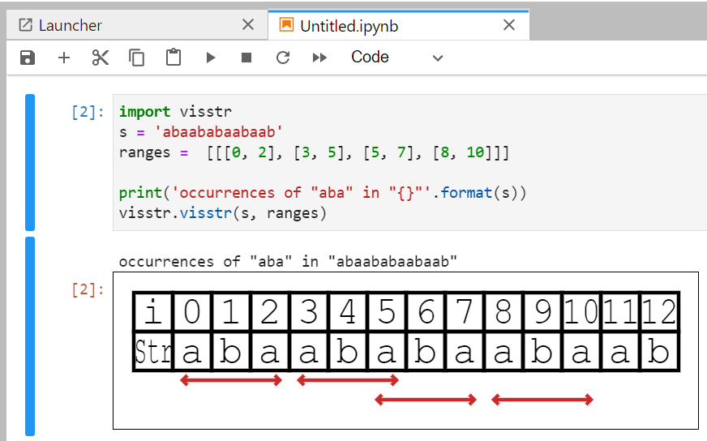

Note: this library is under developping, so its API may be changed in future.

# String Visualizer for Jupyter notebook

This is python binding of string visualizer [visstr](https://github.com/kg86/visstr) written in javascript.



# Install

```bash
$ pip install .
```

# Example

see [example](examples/occ.ipynb).
