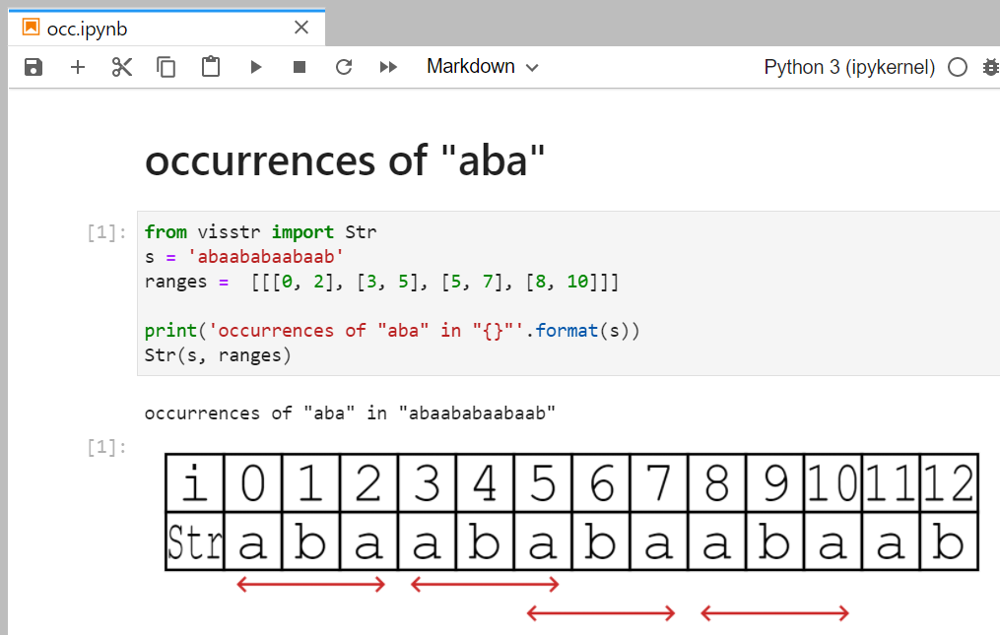

# String Visualizer for Jupyter notebook

This is python binding of string visualizer [visstr](https://github.com/kg86/visstr) written javascript.



# Install

```bash
$ pip install .
```

# Build (for Developer)

```bash
# build vis_str.umd.js, and move it to lib/visstr/vis_str.umd.js
$ bash buildjs.sh
```